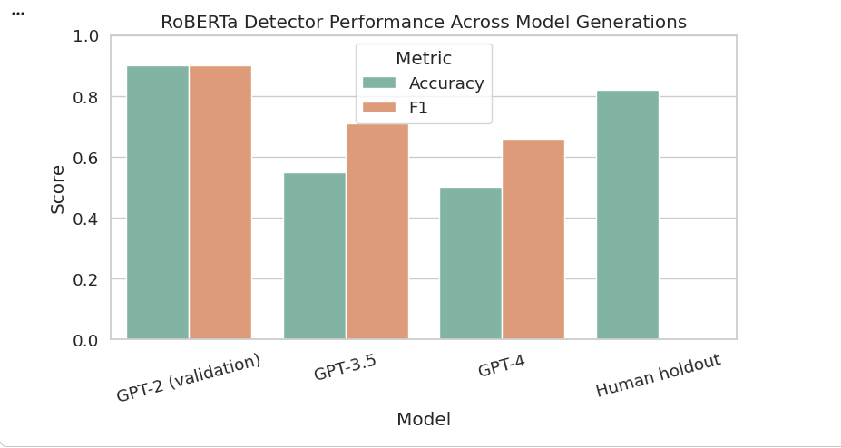

# Evaluating the Generalization of Transformer-based AI Text Detectors from GPT-2 to GPT-4 Texts

Author: Shihao Mai  
Vanderbilt University, Data Science Institute  

## 1. Overview

### 1.1 Problem Statement  
AI text detectors are widely used to distinguish human-written content from machine-generated text.  
Most existing detectors, however, are trained on outputs from older large language models such as GPT-2.  
As newer models like GPT-3.5 and GPT-4 produce more fluent, coherent, and human-like text, it is unclear whether detectors trained on GPT-2-era data can still reliably identify AI-generated content.

### 1.2 Research Goal  
This project investigates whether a transformer-based classifier, specifically RoBERTa-base, trained only on GPT-2 outputs and human-written text, can generalize to detect text generated by GPT-3.5 and GPT-4.

### 1.3 Motivation  
Reliable AI-text detection is important for academic integrity, misinformation filtering, content verification, and AI safety.  
If detectors fail to generalize across model generations, their decisions become unreliable and potentially misleading.  
This project aims to provide quantitative evidence of how much performance degrades when moving from GPT-2 to GPT-3.5 and GPT-4.

### 1.4 Method Summary  
1. Collect datasets from four sources:  
   - GPT-2 outputs (AI)  
   - Human-written WebText (Reddit-based)  
   - GPT-3.5 outputs generated via the OpenAI API  
   - GPT-4 outputs generated via the OpenAI API  

2. Train a RoBERTa-base classifier on GPT-2 outputs versus human-written text only.  

3. Evaluate the trained model on:  
   - GPT-3.5 outputs (unseen generation)  
   - GPT-4 outputs (unseen generation)  
   - A holdout set of human-written samples not used in training  

4. Report performance using Accuracy, F1 score, and ROC-AUC.  

5. Visualize cross-generation degradation and discuss why newer LLMs are harder to detect.

### 1.5 Key Findings  
The detector performs well in the training domain (GPT-2 vs human) but degrades noticeably on GPT-3.5 and GPT-4:  

- Validation on GPT-2 vs human: accuracy around 0.90  
- Test on GPT-3.5: accuracy around 0.55  
- Test on GPT-4: accuracy around 0.50  

These results show that an AI detector trained only on GPT-2-era data does not generalize well to modern LLMs, and can significantly underestimate how much AI-generated content exists in real-world settings.

### 1.6 Visual Results

Accuracy and F1 comparison across model generations:  

Cross-generation degradation trend:  

## 2. Question 1  
Why does a detector trained on GPT-2 outputs fail to identify GPT-4 outputs?

### Answer  
GPT-4 produces text that is significantly more fluent, coherent, and human-like than GPT-2.  
The RoBERTa detector learns GPT-2–specific patterns, such as repetitive phrasing or unnatural transitions.  
When tested on GPT-4, these patterns no longer exist, causing the model to misclassify GPT-4 text as human.  
This mismatch between training distribution and test distribution is the core reason for the generalization failure.

## 3. Question 2  
Would adding a small amount of GPT-3.5 or GPT-4 data during training improve detection performance?

### Answer  
Yes.  
Mixing a small number of samples from newer models into the training set allows the detector to learn updated linguistic patterns.  
This reduces the distribution gap and helps the model recognize features present in newer LLM outputs.  
This idea connects to continual learning: detectors must be updated regularly as LLMs evolve.

## 4. Architecture Overview

### 4.1 Model Structure  
The detector is based on RoBERTa-base, a transformer encoder model.  
Each input text is tokenized, passed through the transformer layers, and the final [CLS] representation is fed into a linear classifier to predict whether the text is AI-generated or human-written.

Pipeline:
1. Input text  
2. Tokenizer  
3. RoBERTa encoder  
4. [CLS] embedding  
5. Linear classification layer  
6. Output probability (AI vs Human)

### 4.2 Training Setup  
Training data: GPT-2 outputs labeled as AI, and human WebText labeled as human.  
Validation: 20 percent split from the training domain.  
Testing: GPT-3.5, GPT-4, and human holdout samples.

### 4.3 Key Difference from Prior Work  
Most existing detectors are trained and evaluated on the same generation of LLM outputs.  
This project evaluates cross-generation generalization, showing how performance drops when the test data comes from newer models not seen during training.

## 5. Critical Analysis

### Strengths  
The experimental design clearly isolates the cross-generation generalization problem.  
The dataset covers four sources: GPT-2, GPT-3.5, GPT-4, and human-written text.  
The evaluation directly measures how performance changes as LLMs evolve.

### Limitations  
The detector is trained only on GPT-2 outputs, which represent an older and simpler distribution.  
Newer LLMs incorporate richer reasoning, more natural phrasing, and better structure, which the detector has never learned.  
The model size (RoBERTa-base) limits its capacity to capture deeper semantic cues.

### Future Improvements  
Include mixed-generation training data for continual model updates.  
Explore interpretability methods such as SHAP or attention-based visualization to understand what linguistic cues the detector relies on.  
Consider retrieval-augmented or hybrid detection methods that use both statistical and semantic signals.

## 6. Impacts

### Technical Impact  
The results demonstrate that AI text detectors trained on older LLM outputs cannot reliably identify text from newer models.  
This indicates that detection systems must be continuously updated or redesigned to keep pace with advancements in generative models.

### Practical Impact  
Platforms that rely on static detectors, such as plagiarism checkers or misinformation filters, may underestimate AI-generated content.  
This affects academic integrity, content moderation, and public trust in automated verification systems.

### Research Impact  
The findings highlight the importance of evaluating cross-generation robustness.  
They also support the idea that detection should not rely solely on surface-level linguistic patterns, since these patterns change quickly as models improve.

### Broader Implications  
As generative models evolve, detection will become increasingly challenging.  
Policies and guidelines must therefore consider continual detector updates, multi-model training, or hybrid human–AI review processes.

## 7. Resource Links

### Relevant Datasets and Models  
GPT-2 Output Dataset  
https://github.com/openai/gpt-2-output-dataset

RoBERTa-base model  
https://huggingface.co/roberta-base

OpenAI API documentation  
https://platform.openai.com/docs/api-reference

### Related Research  
Survey on AI text detection  
https://arxiv.org/abs/2307.09795

### Course Reference  
Vanderbilt University Data Science Institute  
https://dsi.vanderbilt.edu

## 8. Code Demonstration

To view the full implementation, training logs, evaluation metrics, and visualization results,  
please refer directly to the Jupyter Notebook in this repository:

Notebook file: `train.ipynb`  
You can open it on GitHub to see all saved outputs, figures, and intermediate results.

The notebook includes:

1. Data loading and preprocessing  
2. Fine-tuning RoBERTa-base on GPT-2 vs Human  
3. Evaluation on GPT-3.5, GPT-4, and Human holdout  
4. Visualization of performance degradation across LLM generations
